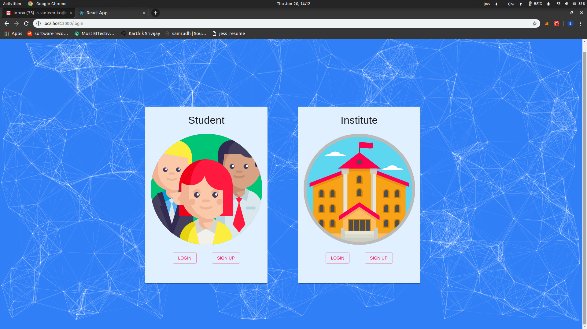
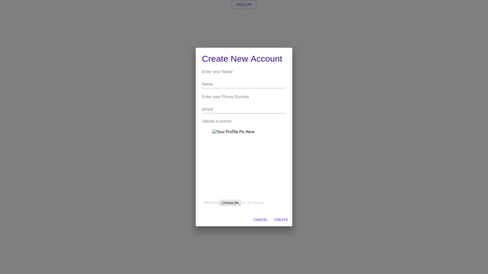
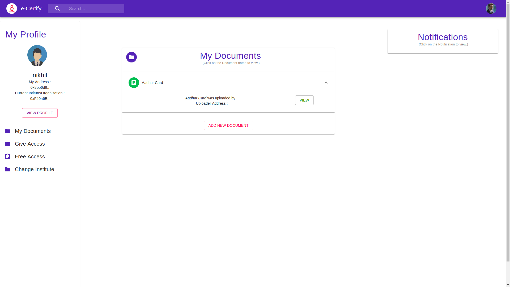
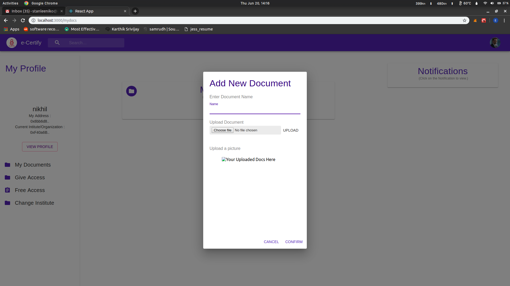
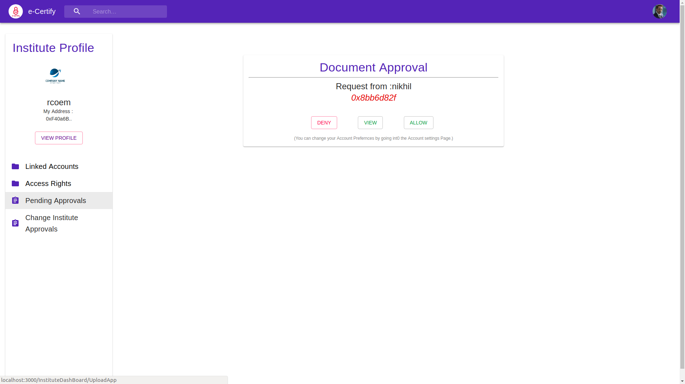

# Dapper-UI is the Front-End  for a Crypto Project-->["E-Certify"](https://github.com/nikhildsahu/E-Certify)

## Link to the Project https://github.com/gauravsharma-gs/E-Certify

### This repository includes all of the front end components for the project.
## It is created by React.js and Material UI v3.0+

The name given to the repository clearly exhibits the neatness and the simplicity of the UI.

This project was bootstrapped with [Create React App](https://github.com/facebook/create-react-app).

#### Added new Modules for React Router using Breadcrumbs (this may help the linkers)

## Samples

 
  
  
 
  
  
 
  
  
 
  

# dapper-ui

